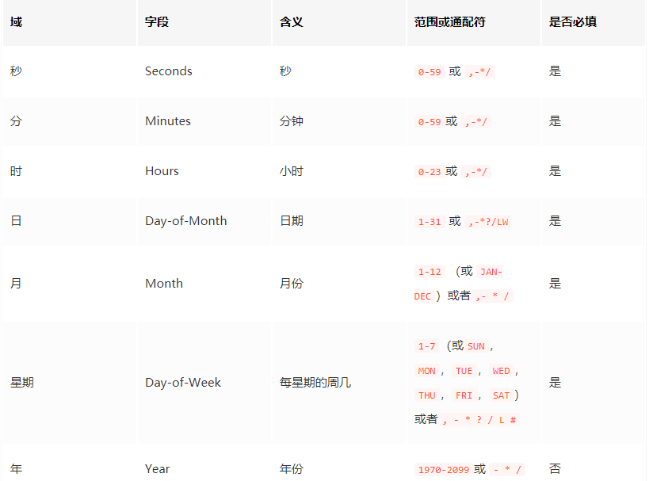
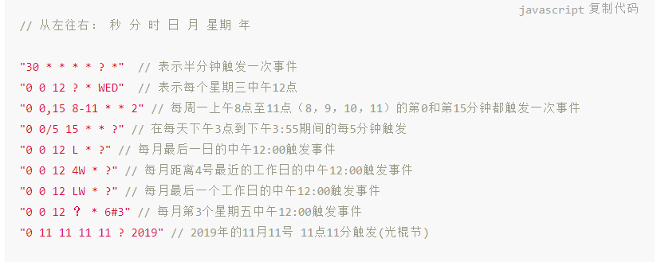

# SpringBoot 中利用 Spring Task 使用定时任务

一个企业级应用中或多或少都会有使用定时任务（也称任务调度）的需求。比如，每天凌晨 3 点执行一次定时任务，删除系统中超过 60 天还未激活的用户。又或者，用户在图形化界面中手动开启一个 3 小时后需要执行的任务。

**按照使用角度划分，可以分为两类：（技术角度）**

- 按照固定的频率执行任务（比如，每个 3 天执行执行一次任务）（周期性任务）
- 按照指定的时间点执行任务（比如，12 小时后执行任务）（基于日历的单次任务）

**按照任务创建方式的角度划分，也可以分为两类：（业务角度）**

- **业务流程产生型：**任务的执行时间离任务的触发时间不长的情况下。比如 3 小时候执行的任务。
- **扫描线程产生型：**通过定期扫描线程根据扫描到的业务数据动态的去创建任务。比如扫描到 60 天内都没有激活的用户，然后创建一个再从线程池中获取一个线程去处理业务。

## 定时任务的几种解决方案

定时任务本身涉及多线程、运行时间规则制定及解析、运行线程保持与恢复（程序突然停止了，就需要持久化定时任务的存储）、线程池维护等多方便的工作。如果直接使用自定义线程这种原始方法，实现起来的难度会很大，而且程序的稳定性也不好。实际上 Java 领域提供了很多任务调度的解决方案（尽管它们底层也是直接使用的自定义线程的方式，但是它们内部做了很多其他的工作，使得这个任务调度的程序变得很可靠）供用户使用。

- Timer/TimerTask
  - 这是 Java1.3 版本增加的用于实现定时任务的工具类，它只能够按照指定的频率执行任务，而不能够在指定的时间执行任务。
  - 功能单一，实际工作中有更好的替代方式，所以，没有必要去了解它哦。
- Executor
  - 这是 Java5.0 juc 包中新增的线程池相关的工具类，两种类型的定时任务都支持。
  - **如果项目确定是一个单体应用，且不需要大量使用到定时任务，那么非常推荐使用它。**
  - **基于日历的单次任务，直接使用它即可。对于周期性定时任务最好是直接使用 Spring Task （对 Java5.0 Executor 的一个封装）。**
- Spring Task
  - 这是 Spring3.0 之后对于定时任务的一个基础性封装，它内部封装了 Timer、Executor 等。
  - 它内部有一个 ThreadPoolTaskExecutor 类，是对于 java.util.concurrent.ThreadPoolExecutor 类的一个封装。对外暴露了一些属性，供开发人员进行配置。
  - **对于单体应用中的固定频率的定时任务，推荐使用它。**
- Quartz
  - 这是一个专业的任务调度框架，能够使用数据库做持久化，同时还能够支持分布式集群（但是使用起来麻烦）。
  - **如果是单体应用，且有大量的定时任务需要使用，推荐使用它。**
- XXL-JOB
  - 这是一个专业的分布式任务调度框架，早期是基于 Quartz 实现的，后期改为自己实现的定时任务引擎。
  - **如果是分布式应用，且有大量的定时任务需要使用，那么推荐使用它。（使用广泛、简单、社区活跃度高）**
- Elastic-Job
  - 这也是一个专业的分布式任务调度框架，它的作者同时还开源了 ShardingSphere ，目前已经是 Apache 的顶级项目了，未来应该也会有很大的发展吧。
  - 如果是分布式应用，到底是应该使用 XXL-JOB 还是 Elastic-Job 呢？我也不知道啊，前者好像使用的多一点吧。

## Cron 表达式

Cron 表达式是一种使用字符串形式来描述周期性定时任务的语法，包括 6~7 个时间元素，元素之间使用空格隔开的。

### Cron 表达式的组成



### Cron 表达式各个通配符的含义


### Cron 表达式的各种使用示例



## Spring Task 的使用

### Spring Task 线程池配置

默认情况下 Spring Task 是使用单个线程来执行所有定时任务，如果系统中的定时任务很多，肯定是需要配置一个线程池的。Spring Task 提供了一个ThreadPoolTaskExecutor 类，是对于 java.util.concurrent.ThreadPoolExecutor 类的一个封装。对外暴露了一些属性，供开发人员进行配置。SpringBoot 中配置线程池的方式如下：

```java
/**
 * 给 Spring Task 配置线程池
 */
@Configuration
@EnableScheduling // 必须加上此注解，否则定时任务不会开启
public class ScheduleConfiguration implements SchedulingConfigurer {
	private static final Logger log = LoggerFactory.getLogger(ScheduleConfiguration.class);

	// 给ScheduledTaskRegistrar对象注入一个ThreadPoolTaskScheduler对象，就拥有了使用线程池来执行定时任务的能力
	@Override
	public void configureTasks(ScheduledTaskRegistrar taskRegistrar) {
		ThreadPoolTaskScheduler taskScheduler = new ThreadPoolTaskScheduler();

		// ThreadPoolTaskScheduler对象核心配置
		taskScheduler.setPoolSize(4);
		taskScheduler.setWaitForTasksToCompleteOnShutdown(true);
		taskScheduler.setThreadNamePrefix("schedule");
		taskScheduler.setRemoveOnCancelPolicy(true);
		taskScheduler.setErrorHandler(t -> log.error("Error occurs", t));
		taskScheduler.initialize(); // 这行代码不能少
		
		// 向 ScheduledTaskRegistrar 对象中注册 ThreadPoolTaskScheduler 对象
		taskRegistrar.setTaskScheduler(taskScheduler);
	}
}
```

### Spring Task 定时任务的配置

Spring Task 是专门用实现固定频率类型的定时任务的，只需要在一个 POJO 类的普通方法上使用  @Scheduled 注解即可。一共有 4 种方式来实现，分别是：

- 指定 cron 表达式

- 指定 fixedRate 属性
- 指定 fixedDelay 属性
- 指定 initialDelay 属性

```java
/**
 * 测试 4 种定时执行任务的写法
 */
@Component
public class SpringTaskJob {
	private static final Logger log = LoggerFactory.getLogger(SpringTaskJob.class);

	private AtomicLong counter = new AtomicLong();

	// 上一次 执行完毕时间点 之后 10 秒再执行。
	@Scheduled(fixedDelay = 10 * 1000L)
	public void scheduleWithFixedDelay() throws Exception {
		try {
			TimeUnit.MILLISECONDS.sleep(10 * 1000L);
		} catch (InterruptedException e) {
			log.error("Interrupted exception", e);
		}
		long count = counter.incrementAndGet();
		log.info("Schedule executor {} times with fixed delay", count);
	}

	// 第一次延迟 2 秒后执行，之后按 fixedRate 的规则每 10 秒执行一次。
	@Scheduled(initialDelay = 2000L, fixedDelay = 10 * 1000L)
	public void scheduleWithinitialDelayAndFixedDelay() throws Exception {
		try {
			TimeUnit.MILLISECONDS.sleep(10 * 1000L);
		} catch (InterruptedException e) {
			log.error("Interrupted exception", e);
		}
		long count = counter.incrementAndGet();
		log.info("Schedule executor {} times with fixed delay", count);
	}

	// 上一次 开始执行时间点 之后 10 秒再执行。
	@Scheduled(fixedRate = 10 * 1000L)
	public void scheduleAtFixedRate() throws Exception {
		long count = counter.incrementAndGet();
		log.info("Schedule executor {} times at fixed rate", count);
	}

	// 根据 cron 表达式定义，每隔 10 秒执行一次。
	@Scheduled(cron = "0/10 * * * * *")
	public void scheduleWithCronExpression() throws Exception {
		long count = counter.incrementAndGet();
		log.info("Schedule executor {} times with ", count);
	}
}
```

## 注意事项

- 静态变量是 ClassLoader 级别的，如果 Web 应用程序停止，那么这些静态变量也会从 JVM 中清除。但是，线程池是 JVM 级别的。**这意味着如果用户在 Web 应用中启动了一个线程，那么这个线程的生命周期并不会和 Web 应用程序保持同步。这是个大坑，但是很多人显然不知道。所以，真正保险的方式是，在程序关闭的时候，手动的去关闭这些线程。**这时候，最好还是利用 Spring 已经实现好了的机制来实现这个功能，不要去自己实现。

## 参考链接

- 《精通Spring 4.x》第 16 章

- https://juejin.im/post/5d653f9ef265da03a31d4792
- https://medium.com/@guraycintir/task-scheduling-in-spring-boot-e70a1069a9f
- https://juejin.im/post/5b31b9eff265da598826c200#heading-1
- http://www.bejson.com/othertools/cron/
- https://www.pppet.net/


