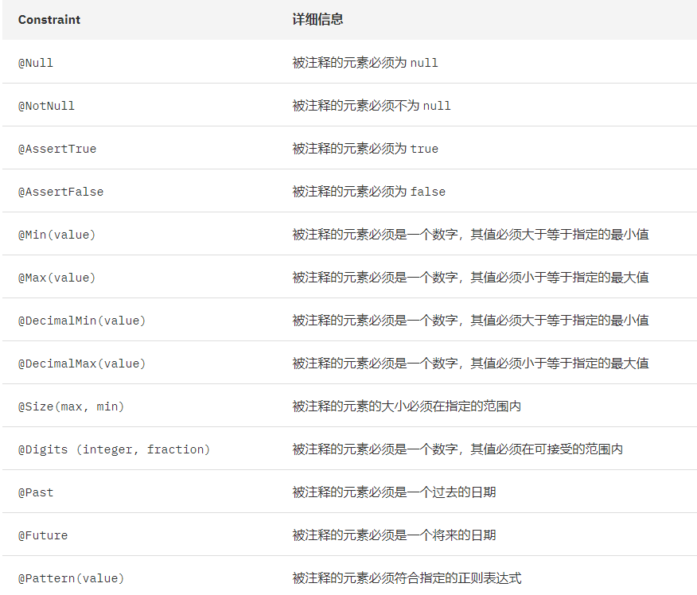
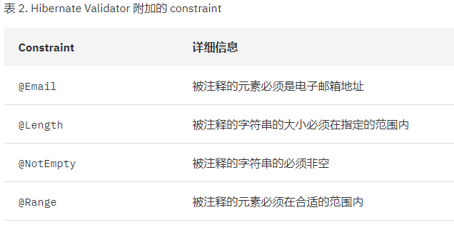

# Spring MVC中的数据校验

**如果想要构建一个安全、健壮的系统，参数的校验是必不可少的一个环节。**虽然绝大部分情况下，只要前端在页面上做好校验就可以了，但是你怎么知道会不会有人绕过前端的校验，而是直接通过其他方式访问你的接口，给你搞破坏呢？对吧。**前端做校验是为了避免普通用户人为输入错误数据的情况，后端则是为了保障系统的安全性**。

**问题是数据校验非常的繁琐，这种校验代码和业务代码冗余在一起，让人很烦，同时也会让代码的可读性、可维护性极大下降。那么有没有比较优雅的解决这种问题的方式呢？当然有啊，那就是 JSR 303 规范** 。它的思想就是在接收请求参数的 POJO 实体类或者参数上加上特定注解，然后再通过 @Valid/@Validated 注解启用校验规则。当然它不仅仅只支持注解，同时还支持使用 XML 和 Java API的方式启动校验规则（但是，基本很少会用）。

**Spring MVC 执行流程的其中一环就是进行数据绑定，在请求参数绑定完成之后的下一步，就是执行数据校验。**

## 名词解释

- JSR303：Java EE 和 Java SE 中用于 JavaBean 验证的 Java API 规范（仅仅是规范，并不提供具体实现）
- Hibernate-Validator：Hibernate 组织提供的一个 JSR303 规范的实现
- Spring-Validator：Spring 框架基于 Hibernate-Validator 封装的，结合了 AOP 来校验参数，避免手动去调用 JSR303 API 来校验参数

## 使用 @Valid 注解和 @Validated 注解的区别

前者是 JDK 中提供的注解，后者则是 Spring 框架中提供的注解。所以，它们的作用就是采用不同的验证框架进行验证。各有各的优点，SpringBoot 中默认同时集成了两者，根据自己的需求灵活应用即可。**原则上推荐优先使用 @Validated 注解，如果 @Validated 注解无法实现，那么采取使用 @Valid 注解哦。**

## 什么是 JSR 303 规范

JSR 303 是一套 JavaBean 参数校验的标准，它定义了很多常用的注解，但是不提供具体验证逻辑的实现。用户可以把这些注解添加在 JavaBean 的属性上，然后通过注解驱动的方式，调用对应的验证框架，来对 JavaBean 中的属性进行校验。**可以参考官方文档或者直接查看 javax.validation.constraints 包下的源码来学习这些注解的作用。**

## JSR 303 规范提供的注解



## Hibernate-Validator 扩展的注解



## SpringBoot 中使用校验注解

既可以在 Controller 层进行数据校验，也可以在 Service 层的接口中进行数据校验。反正我是推崇在 Controller 中进行数据校验的，毕竟 Controller 才是直接提供给外界使用的，而 Service 只有内部人员会用到。

### 通过注解驱动的方式进行数据校验

更多使用方式查看 github 上 code-java 的源码

```java
/**
 * "@Validated"注解的使用(推荐优先使用@Validated注解，除非不得不需要使用@Valid注解时)
 */
@RestController
@Validated
@AllArgsConstructor
public class SysUserController {

	private final SysUserService sysUserService;

	// 这里导入的是 javax.validation.Validator
	private final Validator validator;

	// 自己基于 javax.validation.Validator 封装的工具类
	private final SpringValidatorUtil springValidatorUtil;

	/**
	 * 表单以及GET方式提交参数（这种校验方式就能够生效）
	 * @param sysUserCreateRequestParam sysUserCreateRequestParam
	 * @return rstman
	 */
	@GetMapping("/sysUserCreate")
	public AjaxEntity sysUserCreateForm(@Validated SysUserCreateRequestParam sysUserCreateRequestParam) {
		System.out.println("====================");
		return AjaxEntityBuilder.success(sysUserCreateRequestParam);
	}

	/**
	 * 请求体为JSON时提交参数（这种校验方式就能够生效）
	 * @param sysUserCreateRequestParam sysUserCreateRequestParam
	 * @return r
	 */
	@PostMapping("/sysUserCreateJSON")
	public AjaxEntity sysUserCreateJSON(@Validated @RequestBody SysUserCreateRequestParam sysUserCreateRequestParam) {
		System.out.println("======================");
		return AjaxEntityBuilder.success(sysUserCreateRequestParam);
	}

	/**
	 * 表单以及GET方式提交单个参数（这种校验方式必须、必须、必须需要在控制器的类上使用@Validated注解，即便放在方法上也无效，@Valid注解就更是了）
	 * @param username username
	 * @return rstman
	 */
	@GetMapping("/sysUserCreateRequestParam2")
	public AjaxEntity sysUserCreateForm2(@Length(min = 3, message = "username长度不能小于3") String username) {
		System.out.println("====================");
		return AjaxEntityBuilder.success(username);
	}

	/**
	 * 请求体为JSON时提交参数（这种校验方式能够生效）（这个接口同时也演示了有嵌套子对象时，应该如何进行校验）(这种场景不得不使用@Valid注解)
	 * @param sysUserCreateBatchRequestParam sysUserCreateBatchRequestParam
	 * @return r
	 */
	@PostMapping("/sysUserCreateJSONList2")
	public AjaxEntity sysUserCreateJSONList2(@Valid @RequestBody SysUserCreateBatchRequestParam sysUserCreateBatchRequestParam) 	{
		System.out.println("======================");
		return AjaxEntityBuilder.success(sysUserCreateBatchRequestParam);
	}
}
```

### 通过编码的方式手动校验

```java
@GetMapping("/manualValidator")
public AjaxEntity manualValidator() {
	SysUserCreateRequestParam sysUserCreateRequestParam = new SysUserCreateRequestParam();
	sysUserCreateRequestParam.setUserEmail("1209023760");

	/*
	javax.validation.Validator 类的 validate() 方法返回值是一个Set<ConstraintViolation<T>>类型的集合，对于不满足要求的参数，就会
	生成一个ConstraintViolation对象，并把错误信息封装在它的 message 属性中。
	
	可见，实际使用过程中，应该封装一个工具类，只需要一行代码，然后在不符合校验规则的情况下，就直接抛出异常即可。
	 */
	Set<ConstraintViolation<SysUserCreateRequestParam>> constraintViolationSet = validator.validate(sysUserCreateRequestParam);
    
	for (ConstraintViolation<SysUserCreateRequestParam> sysUserCreateRequestParamConstraintViolation : constraintViolationSet) {
		String message = sysUserCreateRequestParamConstraintViolation.getMessage();
		System.out.println(message);
	}

	if (springValidatorUtil.validate(sysUserCreateRequestParam)) {
		// 校验通过
	}

	return AjaxEntityBuilder.success();
}		
```

封装了 Validator 的工具类，源码如下：

```java
@Component
@AllArgsConstructor
public class SpringValidatorUtil {

	private final Validator validator;

	/**
	 * 校验指定对象
	 *
	 * @param object object
	 * @param groups groups
	 * @param <T>    r
	 */
	public <T> boolean validate(T object, Class<?>... groups) {
		Set<ConstraintViolation<T>> constraintViolationSet = validator.validate(object);
		if (constraintViolationSet != null) {
			StringBuilder stringBuilder = new StringBuilder();
			for (ConstraintViolation<T> constraintViolation : constraintViolationSet) {
				String message = constraintViolation.getMessage();
				stringBuilder.append(message).append(",");
			}
			stringBuilder.deleteCharAt(stringBuilder.length() - 1);
			throw new RuntimeException(stringBuilder.toString());
		}
		return true;
	}
}
```

## 自定义校验注解

**实际业务开发过程中有各种各样的需求，默认的那几个注解肯定是不满足需求的。这个时候，就需要使用到自定义注解啦。对此，Spring 也提供了自定义注解的支持。**使用步骤如下：

- 编写自定义注解

```java
@Documented
@Constraint(validatedBy = {ConstantValidator.class})
@Target({METHOD, FIELD, ANNOTATION_TYPE, CONSTRUCTOR, PARAMETER})
@Retention(RUNTIME)
public @interface Constant {

	String message() default "{constraint.default.const.message}";

	Class<?>[] groups() default {};

	Class<? extends Payload>[] payload() default {};

	String value();
}
```

- 实现**ConstraintValidator**接口，编写对应的校验规则

```java
public class ConstantValidator implements ConstraintValidator<Constant, String> {

	private String constant;

	/**
	 * 初始化方法，一般用来设置注解中指定的值
	 *
	 * @param constraintAnnotation constraintAnnotation
	 */
	@Override
	public void initialize(Constant constraintAnnotation) {
		// 获取设置的字段值，注解的 value 值
		this.constant = constraintAnnotation.value();
	}

	/**
	 * 具体验证逻辑的方法
	 * @param value value
	 * @param context context
	 * @return r
	 */
	@Override
	public boolean isValid(String value, ConstraintValidatorContext context) {
		// 判断参数是否等于设置的字段值，返回结果
		return constant.equals(value);
	}
}
```

## 参考链接

- https://beanvalidation.org/1.0/spec/

- https://hibernate.org/

- https://github.com/iskeqi/code-java/tree/master/022-validator

- https://docs.jboss.org/hibernate/validator/4.2/reference/zh-CN/html/index.html

- https://www.ibm.com/developerworks/cn/java/j-lo-jsr303/index.html

- http://www.iocoder.cn/Spring-Boot/Validation/?github

  