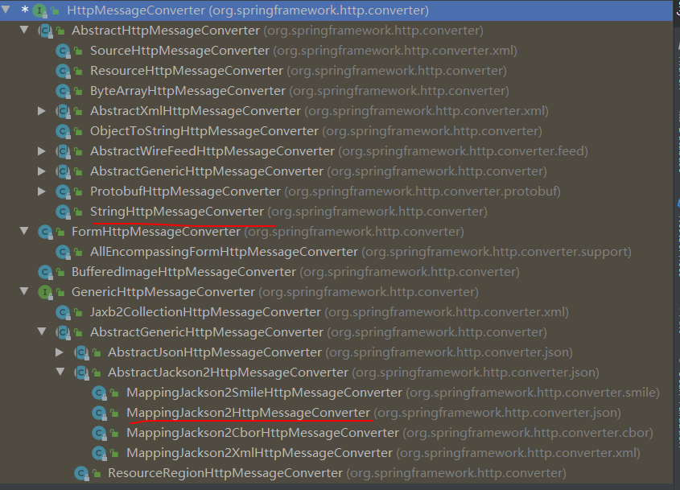
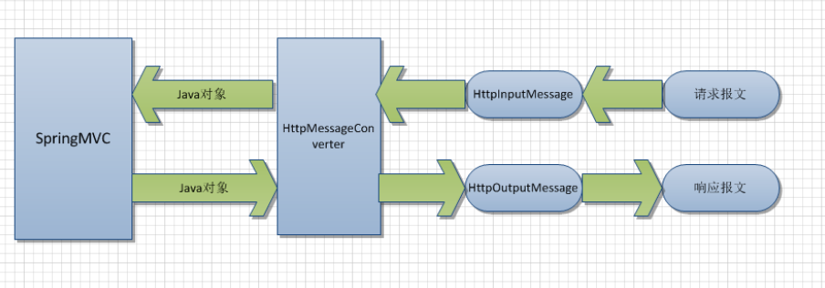

# Spring MVC 中的控制器

Spring MVC 模块中很重要的一个功能就是编写控制器（Controller），在控制器中需要指定请求 URL 和具体的处理方法之间的映射关系，以及在方法签名中接收请求参数。

## Spring MVC 控制器的 3 种编写方式

- 使用注解驱动的方式编写控制器
  - 控制器类无需实现或继承 Spring MVC 的任何接口，类等，就是一个很普通的 POJO 类
  - 控制器类中通过不同的方法来区分不同的接口，这样可以把同一类型的接口都安排在一个控制器中。能够根据业务逻辑有效的组合业务代码。
  - **推荐使用，也是所有人的共同选择**
- 实现 org.springframework.web.servlet.mvc.Controller 接口
  - 一个类中只能编写一个接口
  - **不推荐使用**
- 实现 org.springframework.web.HttpRequestHandler 接口
  - 一个类中只能编写一个接口
  - **不推荐使用**

**之所以要讲这个知识点，是为了方便理解 Spring MVC 执行流程中为什么要在多个 RequestMapping 实现类中找到 URL 对应的控制器（类或者是方法），然后再找到对应的 HandlerAdapter 实现类来调用控制器中的具体方法。因为 Controller 有不同类型，所以需要使用不同的方式去执行它，适配器模式的典型应用。**

## 使用注解进行请求映射

Spring MVC 中很重要的一个功能就是管理请求 URL 和 Controller 中具体方法之间的映射关系，能够让一个请求直接映射到一个方法中去。这个工作具体是由请求映射器 HandleMapping 接口的实现类 RequestMappingHandlerMapping 来完成的！

### 请求 URL 命名规则

Spring MVC 从语法上对请求 URL 的命名规则比较宽松，且支持 Ant 风格。但是，同一团队中的接口 URL 命名是否规范、命名风格是否一致直接决定了接口文档的质量。所以，规范 URL 的命名是很有必要的。

- URL 命名有 3 种命名风格，如下
  - 驼峰命名法（`CamelCase`）
    - **使用最为广泛，推荐使用**
  - 脊柱命名法（`spinal-case`）
    - 所谓脊柱命名法就是使用中划线 `-` 分隔不同单词，例如`dict-type`。（stackoverflow 和 github 就是用的这种方式）
    - 这是在 RFC3986 中明确建议使用的命名方式，但是用的人还是很少，你也就不要标新立异好了！[参考链接](https://blog.restcase.com/5-basic-rest-api-design-guidelines/)
  - 蛇形命名法（`snake_case`）
    - 蛇形命名法 `snake_case`，变量名由多个部分组成，每个部分之间使用下划线 `_` 进行连接，所以也称之为 `下划线命名法`。
    - 不推荐使用，使用起来一点也不好看，尤其是使用 Java 作为编程语言的场景下。（支付宝对外接口倒是使用的这种方式）

- URL 的命名规则必须遵循 `http://ip:port/应用全局路径/模块简称/功能简称/动作/其它` 的规则，比如：`http://localhost:9102/idomp-bjzjc/sc/dict-data/get/dict-type`。
- URL 中增加、删除、修改、查询单个、分页查询这 5 个通用动作，必须固定使用`insert`、`delete`、`update`、`get`、`list`这 5 个单词表示。
- 不建议使用网上很流行的 restful 风格进行 URL 命名，因为实际业务中的接口很复杂，远不是那个中看不中用的 restful 能够满足的。

### 请求映射相关的注解

Spring MVC 中提供了很多注解来进行请求映射，分别介绍如下：

- @ReqeustMapping
  - 该注解可以同时用在控制器类和控制器方法中，但是不推荐使用在类上。因为，这样人为的把一个完整的请求 URL 给拆分成了两段，不利于搜索，哈哈。
  - 该注解默认情况下并不会限制 HTTP 的请求方法，但是可以通过指定的属性来进行指定。
  - 它支持 Ant 风格的 URL
    - ? ：匹配 URL 路径中的一个字符（只能是）
    - *：匹配 URL 路径中的任意个字符（0 个或者多个）
    - **：匹配 URL 路径中的多层路径（0层或者多层）
  - 它支持使用 `{}`作为占位符的请求 URL
    - 配合 @PathVariable 注解就能够获取到 URL 中的值
- @GetMapping
  - **该注解和 @RequestMapping 的作用是一样的，唯独限制了 HTTP 请求方法类型为 GET。推荐使用，能偷懒一点，就偷懒一点哦！**
- @PostMapping
  - **该注解和 @RequestMapping 的作用是一样的，唯独限制了 HTTP 请求方法类型为 POST。推荐使用，能偷懒一点，就偷懒一点哦！**
- @PutMapping
  - 该注解和 @RequestMapping 的作用是一样的，唯独限制了 HTTP 请求方法类型为 PUT。不推荐使用，请求方法有 GET 和 POST 完全够了。
- @DeleteMapping
  - 该注解和 @RequestMapping 的作用是一样的，唯独限制了 HTTP 请求方法类型为 DELETE。不推荐使用，请求方法有 GET 和 POST 完全够了。

```java
@RestController
public class Demo3Controller {

	@RequestMapping("/sys/requestMapping")
	public AjaxEntity requestMapping1() {
		return AjaxEntityBuilder.success();
	}

	@RequestMapping("/sys/ant/*")
	public AjaxEntity requestMapping2() {
		return AjaxEntityBuilder.success();
	}

	@RequestMapping("/sys/ant/?")
	public AjaxEntity requestMapping3() {
		return AjaxEntityBuilder.success();
	}

	@RequestMapping("/sys/ant/**")
	public AjaxEntity requestMapping4() {
		return AjaxEntityBuilder.success();
	}

	@GetMapping("/sys/get")
	public AjaxEntity get() {
		return AjaxEntityBuilder.success();
	}

	@PostMapping("/sys/post")
	public AjaxEntity post() {
		return AjaxEntityBuilder.success();
	}

	@PutMapping("/sys/put")
	public AjaxEntity put() {
		return AjaxEntityBuilder.success();
	}

	@DeleteMapping("/sys/delete")
	public AjaxEntity delete() {
		return AjaxEntityBuilder.success();
	}
}
```

## 获取请求参数

在使用原生 Servlet API 编写 WEB 应用的时候，需要自己手动的从 request 对象中获取请求参数。但是使用了 Spring MVC 之后，只需要使用注解进行配置，Spring MVC 就会自动的注入请求参数到方法对应的形参中。所以，如何获取各类请求参数，是学习 Spring MVC 的重点。获取 HTTP 请求参数的方式，可以分为以下几类：

- 获取请求 URL 路径上的参数，如：/user/123
- 获取 GET 请求 URL 后的参数，如：/user/query?userType=admin&pageNum=2&pageSize=10
- 获取 POST 请求体中的参数
  - Content-Type 属性值为 `form-data` 或者是 `application/x-www-form-urlencoded`时
  - Content-Type 属性值为 `application/json`时
- 获取 Cookie 或者 Header 中的请求参数
- 获取 Servlet API / Spring MVC 中的对象

### 获取请求参数的最佳实践

Spring MVC 作为一个框架，肯定是需要支持多种方式来获取请求参数。但是，作为用户应该要在合适的场景采用合适的方式，而不是一昧的去炫技，用一些冷僻的方式。Spring MVC 接收请求参数可以遵循以下原则：

- 不管任何类型的请求，都只是用 GET 和 POST 两种 HTTP 请求类型
- 对于请求参数不超过 3 个的查询类型的请求，使用 GET 类型且 Content-type 为 application/x-www-form-urlencoded。请求处理方法中对应的是 3 个请求参数，不需要封装成一个 POJO 类
- 对于请求参数超过 3 个的请求，无论是不是查询操作，都统一使用 POST 类型。请求处理方法中对应的是一个 POJO 类，并且 Content-type 的值是 application/json
- 只有在上传文件时，才使用 `form-data`发送请求

### 获取请求 URL 路径上的参数

通过 **@PathVariable** 注解即可获取到请求 URL 路径中的参数

- URL中的变量名和方法参数名相同时，直接在参数前使用@PathVariable。如果不同，则需要通过指定 @PathVariable 的 value 属性来进行不同名称之间的映射
- 一个 URL 中也是可以包含多个变量的，而且能够自动的进行数据类型的转换
- 可以使用正则表达式对URL变量进行更精确的验证，使用方式为：`变量名:正则表达式`

```java
@GetMapping("/user/{userId}/{groupId}")
public AjaxEntity pathVariable(@PathVariable String userId, Long groupId) {
    return AjaxEntityBuilder.success();
}
@GetMapping("/user/{userName:[a-z0-9_]+}")
public AjaxEntity pathVariable(@PathVariable String userName) {
    return AjaxEntityBuilder.success();
}
```

### 获取 GET 请求 URL 后的参数

如果是一个 GET URL 路径后使用 `?` 拼接的参数，可以使用 @RequestParam 注解或者不加注解都可以获取到 URL 路径后跟着的请求请求参数。

```java
// url = "/user?username=123&password=123456"
@GetMapping("/user/get1")
public AjaxEntity get1(String username, String password) {
	return AjaxEntityBuilder.success();
}

@GetMapping("/user/get2")
public AjaxEntity get2(@RequestParam String username, @RequestParam String password) {
	return AjaxEntityBuilder.success();
}
```

### 获取 Cookie 或者 Header 中的请求参数

使用 @CookieValue 注解从 Cookie 中获取请求参数，使用 @ReqeustHeader 注解从 Header 中获取请求参数

```java
@GetMapping("/user/cookie")
public AjaxEntity cookie(@CookieValue("sessionId") String SessionId) {
    return AjaxEntityBuilder.success();
}

@GetMapping("/user/header")
public AjaxEntity header(@RequestHeader("accessToken") String accessToken) {
    return AjaxEntityBuilder.success();
}
```

### 获取 Servlet API / Spring MVC 中的对象

直接在请求方法的签名中声明这些对象，Spring MVC 就会自动的帮你注入。支持通过这种方式获取的对象有：

- HttpServletRequest
- HttpServletResponse
- HttpSession

```java
@GetMapping("/user/get3")
public AjaxEntity get3(HttpServletRequest request, HttpServletResponse response) {
	return AjaxEntityBuilder.success();
}
```

### 获取 POST 请求体中的参数

#### Content-Type 属性值为 `form-data` 或者是 `application/x-www-form-urlencoded`时

- 可以使用单个参数或者是单个 POJO 类来接收参数
- 可以使用 @RequestParam 注解或者不使用

#### Content-Type 属性值为 `application/json`时

- 可以使用 POJO 类或者 String 字符串来接收参数，但是大部分情况下都是使用的前者

## 使用 HttpMessageConverter`<T>`

HttpMessageConverter 是 Spring 的一个重要接口，它负责将 HTTP 请求体的信息转化为一个对象（类型为 T），将对象（类型为 T）转化成响应信息。此接口有 5 个抽象方法，如下：

- boolean canRead(Class<?> clazz, @Nullable MediaType mediaType)
- boolean canWrite(Class<?> clazz, @Nullable MediaType mediaType)
- List<`MediaType`> getSupportedMediaTypes()
- T read(Class<? extends T> clazz, HttpInputMessage inputMessage)
- void write(T t, @Nullable MediaType contentType, HttpOutputMessage outputMessage)

HttpMessageConverter 有很多实现类，类继承结构如下：



Spring MVC 提供了 2 种方法使用 HttpMessageConverter 将请求信息转换成处理方法的入参中

- 使用 @RequestBody/@ResponseBody 对处理方法进行标注（**推荐使用**）
- 使用 HttpEntity<T> 和 ResponseEntity<T> 作为处理方法的入参或者返回值（不推荐使用）

### HttpMessageConverter 的工作流程

HttpMessageConverter 的作用就是将 HTTP 请求体中的数据转换成处理方法的入参，将处理方法的返回值转成换 HTTP 响应体中的内容。流程图如下：



- @RequestBody：Spring 首先根据请求头的 Content-Type 属性选择对应的 HttpMessageConverter ，然后再根据处理方法中使用了 @RequestBody 标注的参数的类型来得到最终匹配的 HttpMessageConverter 。找到对应的 HttpMessageConverter 后，就调用它的 read() 方法将请求体中的参数转换到方法入参中。
- @ResponseBody：Spring 首先根据处理方法的返回值类型找到对应的 HttpMessageConverter ，然后再根据请求头的 Accept 属性来确定最终的 HttpMessageConverter 对象。找到对应的 HttpMessageConverter 后，就调用它的 write() 方法将方法的返回值作为响应参数序列化到 response 输出流中。

### 关于 HttpMessageConverter 的零散知识点

- @RequestBody 和 ResponseBody 并不需要成对出现
- 只要配置好了 JSON 和 XML 对应的 HttpMessageConverter 对象后，在具体的 HTTP 交互中，只需要指定好 Accept 和 Content-type 属性，就能够透明的在 XML  和 JSON 中进行切换。

### HttpMessageConverter 的底层实现原理

本质上就是把 Servlet API 进行了封装，类似的实现机制如下：


## 参考链接

- https://dzone.com/articles/5-basic-rest-api-design-guidelines
- https://xovel.cn/article/naming-rule.html  
- https://cloud.tencent.com/developer/article/1147018